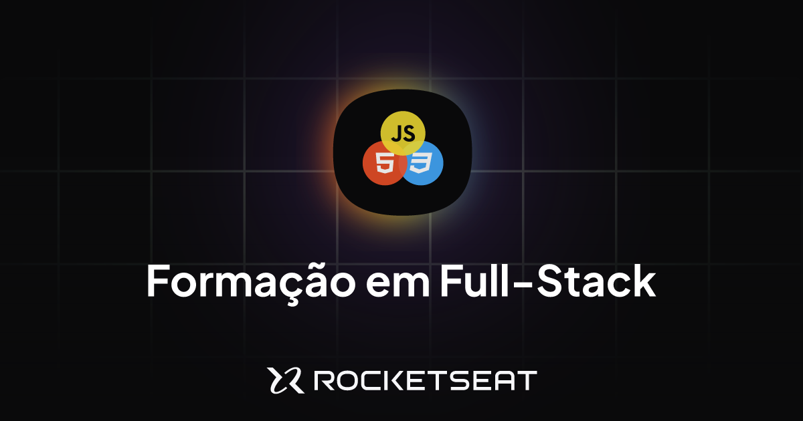

# 📚 Formação Full‑Stack Rocketseat

_A formação completa  Full Stack_



## 🚀 Sobre o Curso

A Formação Full‑Stack da Rocketseat oferece uma trajetória de aprendizado do zero ao avançado em programação web: HTML, CSS, JavaScript, TypeScript, React, Node.js e muito mais ([rocketseat.com.br](https://www.rocketseat.com.br/formacao/fullstack?utm_source=chatgpt.com)). São dezenas de módulos, centenas de aulas e projetos práticos que preparam para o mercado de trabalho.

## 🎓 Conteúdos e Estrutura

- Primeiros Passos e Fundamentos da Web  
- Versionamento com Git e GitHub  
- HTML & CSS (iniciação e avançado)  
- JavaScript, TypeScript  
- Backend com Node.js e API REST  
- React, React Native e desenvolvimento Full Stack ([app.rocketseat.com.br](https://app.rocketseat.com.br/journey/full-stack?utm_source=chatgpt.com), [github.com](https://github.com/LucasSouza17/mba-fullstack-rocketseat?utm_source=chatgpt.com))

## 🛠 O que você aprende

- Estruturas semânticas com HTML  
- Layouts responsivos com CSS Grid e Flexbox  
- Interatividade com JavaScript e TypeScript  
- Desenvolvimento de APIs e arquiteturas backend  
- Interfaces modernas com React, criação de mobile apps  
- Projetos práticos para turbinar o portfólio

## 🧪 Projetos Desenvolvidos

Durante a Formação Full‑Stack, foram desenvolvidos vários projetos práticos para aplicar os conceitos aprendidos. Abaixo, você encontra alguns deles com link direto para visualizar:

### 🔹 Portal de Notícias com HTML e CSS Grid

Página de portal de tecnologia com layout responsivo, utilizando `grid-template-areas`, `gap`, `grid-flow-col` e boas práticas semânticas. Ótimo para treinar estrutura de layout moderno.

🔗 [Acessar projeto](https://emersonromana.github.io/tech-news/)

---


## 📁 Como usar este projeto

```
project-root/
├── assets/
│   └── images/
│       └── rocketseat_fullstack_capa.png
├── src/
│   ├── index.html
│   ├── styles/
│   └── scripts/
├── README.md
└── package.json
```

## ✅ Como rodar

1. Clone o repositório  
2. Instale dependências:
   ```bash
   npm install
   ```
3. Execute o projeto localmente:
   ```bash
   npm start
   ```
4. Abra `index.html` no navegador ou use o Live Server.

---

## 👍 Por que seguir essa formação?

- Mentoria e comunidade ativa da Rocketseat  
- Projetos reais para aplicar conhecimento  
- Certificado reconhecido ao final da jornada  
- Ideal para desenvolver habilidades práticas e conquistar sua primeira vaga ([github.com](https://github.com/LucasSouza17/mba-fullstack-rocketseat?utm_source=chatgpt.com), [pt.wikipedia.org](https://pt.wikipedia.org/wiki/Rocketseat?utm_source=chatgpt.com))

---

> **Nota:** A imagem da capa foi extraída da plataforma Rocketseat para fins ilustrativos e deve estar salva em `assets/images/` com o nome `rocketseat_fullstack_capa.png`.

---

Feito com 💜 por quem acredita na educação prática e acessível para formar a próxima geração de devs.