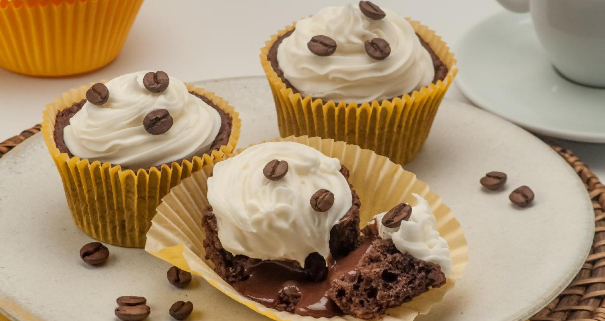

# ☕ Cupcake de Café com Chantilly

Uma página web desenvolvida em HTML e CSS que apresenta a receita de cupcakes de café com chantilly de maneira elegante e acessível. Este projeto é ideal para praticar estilização, semântica e organização de conteúdo seguindo um layout inspirado no Figma.

## 🧁 Sobre o projeto

Esta página tem como objetivo apresentar:
- Uma receita completa e fácil de seguir
- Imagens atrativas e design clean
- Uso de tipografia refinada (Google Fonts: **Alice**)
- Cores suaves, tipografia ajustada e espaçamento amigável

## 🎨 Tecnologias utilizadas

- HTML5 semântico
- CSS3 com:
  - Flexbox para layout
  - Fonte personalizada via Google Fonts
  - Variáveis CSS (`:root`) para cores consistentes
  - Estilização tipográfica com `font-feature-settings`

## 🖼️ Visual do site

Veja abaixo uma prévia da interface da página:

> Imagem de capa exibindo três cupcakes com chantilly e grãos de café

## 📁 Estrutura de arquivos

projeto-cupcake/ ├── img/ │ ├── bg-image.png # Imagem de fundo decorativa │ └── main-image.png # Imagem principal dos cupcakes ├── style.css # Estilos personalizados ├── index.html # Página principal └── README.md # Documentação do projeto

## 📃 Conteúdo da página

### Ingredientes:

- Café solúvel, chocolate em pó, ovos, açúcar, farinha de trigo, fermento, óleo, leite condensado, chantilly e grãos de café para decorar.

### Preparo:

- Massa feita no liquidificador e assada por 25 minutos.
- Recheio de brigadeiro de café cozido e resfriado.
- Finalização com chantilly decorado em círculos e grãos de café.

## 🌐 Como visualizar

Para abrir o projeto localmente:

1. Faça o download dos arquivos
2. Abra `index.html` com seu navegador favorito

Se você hospedou o projeto, cole aqui o link:

**[🔗 Ver site online](https://emersonromana.github.io/cupacake-receita-simples/)**

## 👨‍🍳 Créditos

Projeto desenvolvido por **Emerson**, como parte de estudos em desenvolvimento web e estilização com base em designs reais.

---

Quer que eu gere uma versão em inglês ou complemente com uma seção de deploy? É só pedir! 😄